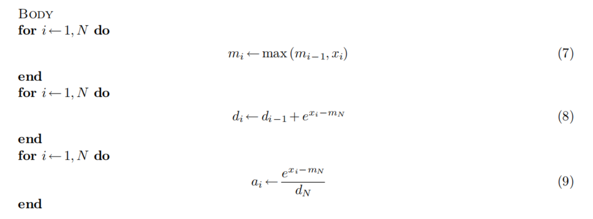

# Flash Attention

# 引言

**Flash Attention** 是一种**高效的注意力计算算法**，旨在减少计算 Transformer 自注意力机制时的 **内存访问开销**，从而提高计算效率并降低显存使用。它主要通过 **分块计算**（tiling）和 **I/O 优化** 来提升性能，使得在 GPU 上处理大规模 Transformer 模型更加高效。

---

## Attention 机制

首先我们回顾一下 标准 `scaled dot-producted attention` 的原理以及它的问题在哪。

简单说，就是为输入序列中的每个元素（比如一个词），计算一个“注意力得分”，表示它与其他元素的相关程度。然后用这些得分作为权重，对所有元素的表示（Value）进行加权求和，得到这个元素的新表示。

给定查询（Query, Q）、键（Key, K）、值（Value, V）三个矩阵，它们通常是由同一个输入序列经过不同的线性变换得到的。假设**输入序列长度为 N，每个元素的特征维度为 d**。那么 Q, K, V 的维度通常是 (N, d)。

标准Attention的计算公式如下：

$$
Attention(Q,K,V) = softmax( \frac {QK^T}{\sqrt d_k})V
$$

这里的 $d_k$ 通常就是 K 矩阵的特征维度 d。除以 $\sqrt{d_k}$ 是为了缩放（Scaling），**防止点积结果过大导致softmax梯度消失**。

### 计算步骤分解

咱们把这个公式拆解成一步步的计算任务：

- Step 1: 计算 $P = QK^T$
    - 这是一个矩阵乘法。Q 的维度是 (N, d) , $K^T$的维度是 (d, N);
    - 得到的 P 矩阵维度是 (N, N)。这个 P 矩阵，我们叫它“注意力分数矩阵”（Attention Score Matrix），它存储了序列中任意两个位置之间的原始相关性得分。
    - **痛点来了！** 这个 P 矩阵的大小是 N x N。如果 N = 8192（8k序列长度），那么这个矩阵就有 8192 * 8192 ≈ 6700万个元素。如果用FP32（4字节）存储，就需要大约 256MB 内存。看起来不大？但别忘了，这只是一个Attention头的一层计算中的一个中间结果！大模型里有几十上百个头、几十层呢！而且，关键在于**读写**这个矩阵。
    
    ---
    
    1. **每个 FP32 数值占用 4 字节（32 bit = 4 Byte）**
    2. **矩阵的总元素个数**：
        
        8192×8192=67,108,864（个元素）
        
    3. **总占用内存**：
        
        67,108,864×4（Byte）=268,435,456（Byte）
        
    4. **转换单位**：
        
        268,435,456÷(1024×1024)=256 MB
        
    
    ### **最终结果**
    
    一个 **8192×8192的 FP32 矩阵** 需要 **256 MB** 的内存空间。
    
    - **1 Byte = 8 bit**
    - **1 KB = 1024 Byte**
    - **1 MB = 1024 KB = 1,048,576 Byte**
    - **1 MB = 8,388,608 bit**

---

- Step 2: 计算 $S = softmax( \frac P {\sqrt{d_k}})$
    - 这里的 softmax 是按行（row-wise）进行的。也就是说，对 P 矩阵的每一行，独立地应用 softmax 函数。
    - 得到的 S 矩阵维度仍然是 (N, N)。这个 S 矩阵，我们叫它“注意力权重矩阵”（Attention Weight Matrix），里面的每个值都在0到1之间，且每行之和为1。
    - **痛点继续！** 计算 softmax 需要读取整个 P 矩阵，计算完毕后，又需要把整个 S 矩阵写回内存。
- Step 3: 计算  $O = SV$
    - 又一个矩阵乘法。S 的维度是 (N, N)，V 的维度是 (N, d)。
    - 得到的 O 矩阵维度是 (N, d)。这就是最终的 Attention 输出。
    - **痛点三连！** 计算 O 需要读取 S 矩阵和 V 矩阵。

## **标准Attention的性能瓶颈：内存墙（Memory Wall）**

好了，接下来总结一下标准Attention在GPU上执行时的遭遇：

- **大量的内存读写（I/O）：**
    - 从GPU的全局内存（HBM，High Bandwidth Memory，虽然叫高带宽，但相比计算速度还是慢）读取 Q, K, V。
    - 计算 $P = QK^T$，将巨大的 P 矩阵写回 HBM。
    - 从 HBM 读取 P 矩阵，计算 $S = softmax( \frac P {\sqrt{d_k}})$ ，将巨大的 S 矩阵写回 HBM。
    - 从 HBM 读取 S 矩阵和 V 矩阵，计算 O = SV ，将最终结果 O 写回 HBM。
- **中间结果巨大：** P 和 S 这两个 N x N 的矩阵是罪魁祸首。它们的读写占用了大量的内存带宽。
- **计算/访存不平衡：** 现代GPU的计算能力（FLOPS）增长速度远超内存带宽（Bytes/s）的增长速度。Attention计算中涉及大量的矩阵乘法，这些是计算密集型操作（理论上）。但是，由于频繁地读写巨大的中间矩阵 P 和 S，导致GPU大部分时间不是在忙着计算，而是在**等待数据从慢速的HBM搬运到快速的计算单元（如Tensor Core）或者片上缓存（SRAM）**。这种情况，称之为**内存带宽受限（Memory-Bound）**。

如果你是一位顶级大厨（GPU计算单元），厨艺精湛（计算速度快）。但你的厨房（GPU）里只有一个小小的备菜台（SRAM/Cache），大部分食材（Q, K, V, P, S）都放在一个巨大的冷库（HBM）里。你每次炒一道菜（计算一步），都要亲自跑去冷库把所有需要的食材（整个大矩阵）搬出来，加工一下（计算），再把半成品（中间矩阵P或S）送回冷库，然后再跑去冷库拿半成品和其他食材，继续加工... 是不是大部分时间都浪费在跑腿（内存读写）上了？

**GPU：** “我算得快有啥用？等数据等得花儿都谢了！带宽！我要带宽！”

这就是标准Attention的流程，伤敌（完成计算）一千，自损（浪费时间在I/O上）八百。尤其当 N 增大时，N^2 的内存访问量简直是噩梦。

---

# softmax→ safe-softmax

首先我们回顾一下 `softmax` 的计算公式，`softmax` 能将任意实数向量转化为一个概率分布。假设有一个输入向量 $x = (x_1, x_2, ..., x_N)$， softmax 定义如下：

$$
{softmax}(x_i) = \frac{e^{x_i}}{\sum_{j=1}^{N} e^{x_j}},\quad \text{for } i=1,2,\ldots,N
$$

但如果 $x_i$ 很大，  `softmax`  可以存在溢出的问题。例如 `float16` 能表示的最大的数是65536， 但是 $e^{11} > 65536$。

为解决这个问题，可以采用 `safe-softmax` ,即所有的向量元素减去最大值 $m = max(x_j) , j = 1,2,\ldots,N$

$$
{softmax}(x_i) = \frac{e^{x_i - m}}{\sum_{j=1}^{N} e^{x_j-m}},\quad \text{for } i=1,2,\ldots,N
$$

**推导**：

$$
e^{x_i} = e^{x_i - m} * e^m = e^{x_i -m +m}
$$

---

## 计算流程

数据初始化之后一般会被存储在内存之中。

1. 找出最大值，
    1. $m_i$ : 前i个元素中的最大值
    
    $$
    m_i = max_{j=1}^{i} {{x_j}}, m_0 = -\infty
    $$
    

1. 计算 `softmax` 分母 ${d_i}$ ;

$$
d_i = \sum_{j=1}^{i} e^{x_j - m_N}, d_0 = 0
$$

1. 计算 ${a_i}$

# Online Softmax

如果可以融合上述计算过程，那就可以减少内存访问的次数。 我们发现现在公式（8） 依赖于 $m_N$，因此不能直接融合公式（7） 和公式（8）。有什么办法吗？

重新定义一个变量 ${d'_i} = \sum_{j=1}^{i} e^{x_j-m_i}$,  可以发现 $d_N = d'_N$。 现在推导 $d'_i 和 d'_{i-1}$的关系

因此 ，计算可以转化为：

其中, $m_0 = -\infty; d'_0 = 0$

由于要计算 ${a_i}$， 所以 `Online softmax` 需要  `two passes` 。

# Self Attention

但在自注意力机制中，我们最终的目标并不是注意力分数矩阵 `A`,而是矩阵 `O`。

 其计算方式为 $O = A*V$。那么，我们是否可以找到一种**单遍递推**形式来计算`O` 呢？

让我们尝试将**Self-Attention**计算的第k 行（由于所有行的计算是独立的，我们仅以一行的计算过程进行解释）表示为一个**递推算法：**

- $Q[K,:]$: Q矩阵的第k行；
- $K^T[:,i]$:  $K^T$矩阵的第i列；
- $O[K,:]$: 输出矩阵O的第k行；
- $V[i,:]$: V矩阵的第i行；
- ${o_i}: \sum_{j=1}^{i} a_jV[j,:]$  前i个向量表示之和

将 $a_i$ 代入公式，得到 $o_i$

$$
o_i := \sum_{j=1}^{i}( \frac {e^{x_j - m_N}} {d'N} V[j,:])
$$

和之前一样， 定义一个新的变量  $o'_i := \sum_{j=1}^{i}( \frac {e^{x_j - m_i}} {d'i} V[j,:])$， 同样 ${o'}_N = o_N$

# Flash attention Algorithm

### Tiling

- b: block size of the tile （K块中的列数）；
- #tiles: the number of tiles in the row , N = b * #tiles ( 块数量 )；
- ***x**i*: a vector storing the *Q*[*k*] *KT* value of the *i*-th tile [(*i ¡* 1) *b*:*i b*]；
- $m^{(local)}_i$: the local maximum value inside ***x**i*
.

# 

# 反向传播

神经网络训练的时候，不仅要进行前向传播，还需要反向传播（计算梯度以更新模型参数）。标准的attention 在反向传播时，通常需要用到前向传播时计算出来的巨大的 N*N的 S矩阵或者P矩阵。这就意味着，训练时必须在内存中保留这个大家伙，内存开销巨大。

Flash attention 在反向传播中也施展了模型。它不需要存储整个 N*N的S矩阵！ 怎么做到的？

- 重新计算： 反向传播需要用到S矩阵的某一部分 $S_{ij}$ 时， Flash attention 利用其 Tiling 结构，重新从HBM中加载对应的 $Q_i$ 和 $K_j$ , 在SRAM中重新计算出 $P_{ij}$ 以及相应的 $S_{ij}$ 部分；
- 存储优化： 为了能够正确地计算出softmax值，Flash attention 在前向传播时， 只需要为每个Q块存储最终的 Online softmax 统计量（每行的最大值 $m_i$ 和 归一化因子 $l_i$）

**反向传播优化的好处：**

- **巨大的内存节省：** 训练时不再需要存储 N x N 的 Attention 矩阵！这使得我们可以用同样的 GPU 内存训练更长的序列（更大的 N），或者训练更大的模型（更多的参数）。对于动辄几千上万序列长度的 LLM 来说，这简直是救命稻草！
- **计算换内存：** 这种做法是用一些额外的计算（重新计算 $S_{ij}$ ）来换取巨大的内存节省。在现代 GPU 上，计算通常比内存带宽更“便宜”，所以这笔交易非常划算。
    
    

# Tiling

FlashAttention 不再试图一次性计算整个 N x N 的 P 矩阵和 S 矩阵。它把 Q, K, V 矩阵在 N 维度上（也就是序列长度维度）切分成一个个小块（Tiles）。

- 想象一下，Q 被切成了 $T_r$ 块，每块大小为 ( $B_r$ , d)。
- K 和 V 被切成了 $T_c$  块，每块大小分别为( $B_c$, d)和 ( $B_c$ , d)。
    - 这里的 $B_r$ 和 $B_c$ 就是块大小（Block Size），通常选择为 64, 128 或 256，这个大小的选择需要权衡，要能让一块 Q、一块 K、一块 V 以及它们计算产生的中间结果都能舒服地塞进 GPU 的快速片上内存（SRAM）。

**SRAM：** “我虽然小（通常只有几十MB），但我快啊！在我这里读写，比去HBM快几个数量级！”

然后，FlashAttention 使用两层嵌套循环来计算最终的输出 O：

- **外层循环 (Outer Loop):** 遍历 K 和 V 的所有块（假设 K 和 V 的分块方式相同）。对于 K/V 的第 `j` 块 $K_j$ , $V_j$：
    - 将 $K_j$ 和 $V_j$ 从 HBM 加载到 SRAM。 （**一次 HBM 读取**）
- **内层循环 (Inner Loop):** 遍历 Q 的所有块。对于 Q 的第 `i` 块  $Q_i$：
    - 将  $Q_i$从 HBM 加载到 SRAM。（**一次 HBM 读取**）
    - **核心操作：** 在 SRAM 内部，计算  $Q_i$ 与当前外层循环加载的 $K_j$ 之间的注意力得分块： $P_{ij} = Q_iK^T_j / \sqrt{d_k}$
    - **核心操作：** 计算当前块的 Softmax。 **注意！** 这里不能直接对 $P_{ij}$ 做 Softmax，因为 Softmax 需要看到 $Q_i$ 与 *所有* K 块 计算得到的得分 才能正确归一化。
        
        FlashAttention 使用了一种巧妙的 **在线（Online）Softmax** 技巧。它在处理 $K_j$ 时，会结合之前处理 $K_1,\dots,K_{j-1}$  累积的统计量（当前行的最大值  m 和归一化因子 l ），来更新当前块 $Q_i$的最终输出 $O_i$。
        
    - 具体来说，对于  $Q_i$的每一行 $q_{row}$ ，它会维护两个值：
        - $m_{row}$ : 到目前为止（处理到  $K_j$）， $q_{row}$  与 $K_1,\dots,K_{j-1}$ 计算得到的原始得分中的最大值。
        - $l_{row}$ : 到目前为止，基于 $m_{row}$ 计算得到的未归一化的 Softmax 指数和 $\sum_{k=1}^{j} \sum_{col \in K_k} exp(p_{row, col} - m_{row}) 。$
            
            
    - 当计算 $P_{ij} = Q_i K_j^T$ 后，对于 $Q_i$的每一行 $q_{row}$ ：
        - 找到 $P_{ij}$ 中对应行的最大值  $m_{row, new}$
        - 更新全局最大值  $m_{row, global} = max(m_{row}, m_{row, new})$
        - 使用新的全局最大值，调整（rescale）之前的累积和 $l_{row}$ 以及当前的输出 $O_{row}$
        - 计算当前块的指数项 $p'_{ij} = exp(P_{ij} - m_{row, global})$ 。
        - 计算当前块的指数和 $l_{row, new} = \sum_{col \in K_j} p'_{ij}[row, col]$ 。
        - 更新全局指数和 $l_{row, global} = l_{row} \times exp(m_{row} - m_{row, global}) + l_{row, new}$ 。
        - 计算当前块对最终输出的贡献 $O_{ij} = p'_{ij} V_j$ 。
        - 更新最终输出 
        
        $O_{row} = O_{row} \times exp(m_{row} - m_{row, global}) + O_{ij}$
    - **核心操作：** 使用更新后的 Softmax 权重（隐式地通过 $p'_{ij}$ 和 $l_{row, global}$ 体现）乘以 $V_j$ 块，累加到 $Q_i$ 块对应的输出 $O_i$ 上。 $O_i = O_i + S_{ij} V_j$ （这里的 $S_{ij}$ 是根据 Online Softmax 算出来的有效权重）。
    
    - **关键点：** 所有这些 $P_{ij}$ 的计算、Online Softmax 的更新、以及 $O_{ij}$ 的计算和累加，都发生在 **SRAM** 内部！只有 $Q_i, K_j, V_j$ 是从 HBM 读入 SRAM 的，中间的 $P_{ij}$ 和局部的 Softmax 计算结果 **从未** 被写回到 HBM。
        
        
- 当内层循环遍历完所有 $Q_i$ 后，外层循环继续处理下一块  $K_{j+1}, V_{j+1}$ 。
- 当外层循环遍历完所有 K/V 块后，每个  $O_i$ 块都已经累加了所有来自 $V_j$ 的贡献，并且通过 Online Softmax 保证了正确的归一化。
- 最后，将计算完成的所有 $O_i$ 块从 SRAM 写回到 HBM。（**一次 HBM 写入)**

# 参考链接

- [https://www.zhihu.com/question/611236756/answer/1890112400390350157](https://www.zhihu.com/question/611236756/answer/1890112400390350157)